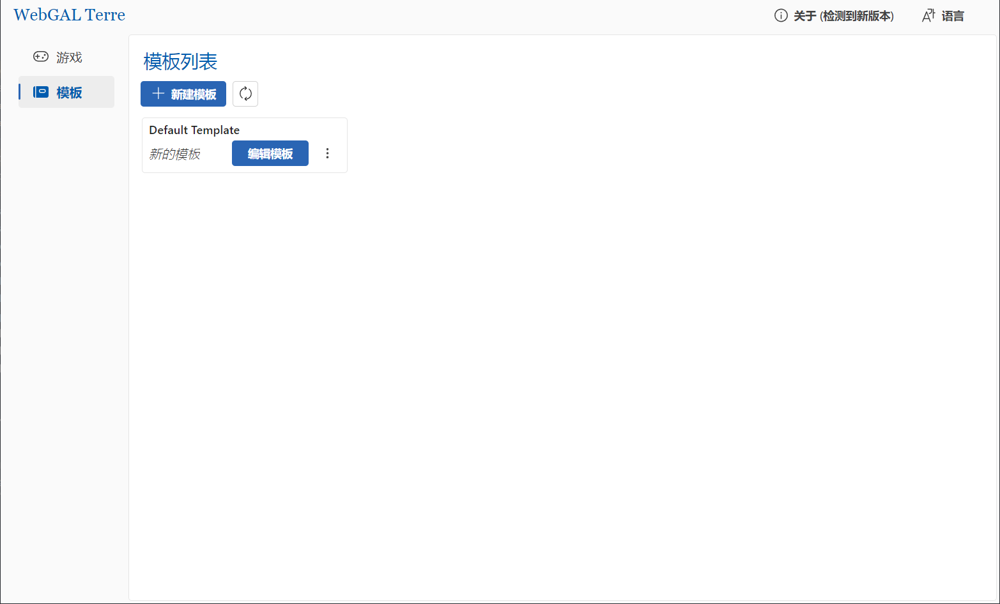
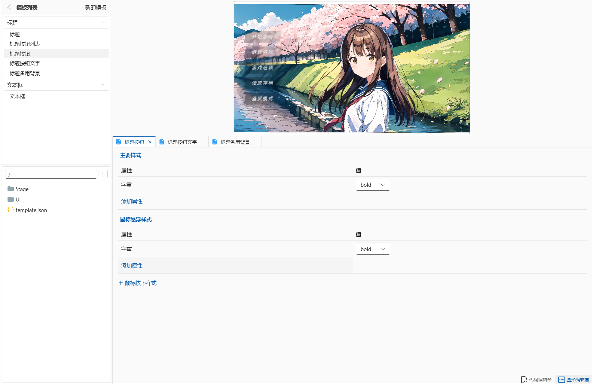
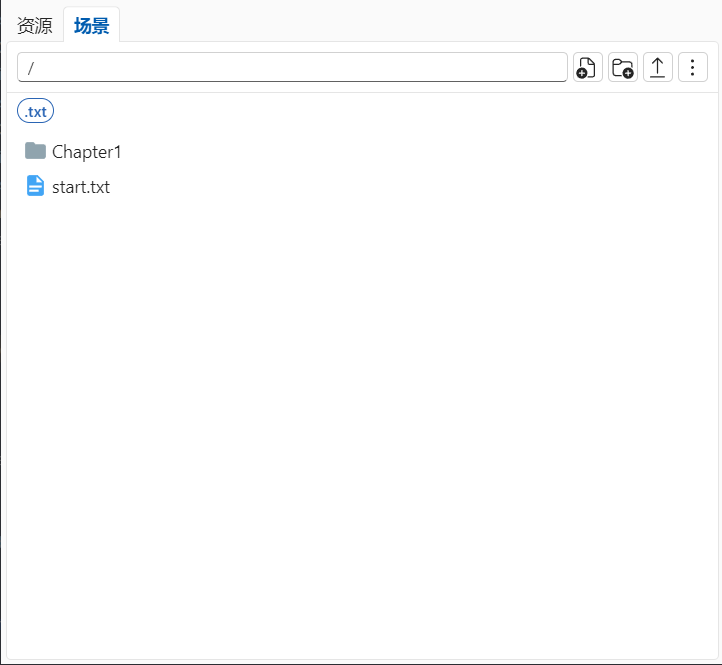

## 引言

各位关注 WebGAL 的朋友们，久等了。

距离 WebGAL 项目组公布 [WebGAL UI 自定义技术解决方案](/zh-cn/blog/rfc2) 已经过去近三个月之久。基于这样的技术方案，在我们的项目组成员的持续努力下， WebGAL 自定义 UI 功能的基础设施建设可以宣布告一段落。

在完成了基础设施的建设后，剩下的就是一些填补功能的工作。我们目前还需要完成数十项 CSS 属性的图形化编辑组件，并且改变创建一个 WebGAL 游戏的方式。我们将允许用户从自定义的模板，以至于自定义的改版引擎创建游戏。

虽然剩余的工作仍然繁重，但是无论如何，最困难的一步已经迈过。尽可能降低开发门槛是 WebGAL 项目组的核心理念。我们将会争取创建出高质量且易用的组件，让自定义 UI 成为一件简单而充满享受的事。

## 4.5 取得的进展

现有的 WebGAL Terre 编辑器主页将添加新的功能，用于管理模板，并可进入模板编辑器。

在模板编辑器中，用户将可以选择自己想要编辑的组件，并修改和添加我们支持编辑的属性。这些属性可能包括字体颜色、字体大小、背景颜色或图片、变换、内外边距等丰富的自定义样式属性。并且，还可以根据鼠标指针悬浮或按下组件的状态，切换对应的样式。

任何样式文件的修改将会立刻反映在编辑区域上方的预览区域中。这是 WebGAL 项目一贯以来的风格，我们理解创作者总是希望自己的修改结果能够立刻得到反馈，这也是我们一直以来为提升创作者获得感努力的方向。

## 将会一同发布的其他改进

WebGAL 的资源管理组件现已完全重构，用户将可以在编辑器内完成更多操作，比如创建新的 JSON 文件用于编写自定义动画。

由于我们完全重构了资源管理组件，现在场景文件管理也变得更加自由，可以按照文件夹来区分不同用途的场景文件。

## 致谢

如果没有 WebGAL 项目组的贡献者的持续努力，这款引擎和其最有竞争力的衍生项目——编辑器项目，将无法取得今天的进展。

**在 4.5 版本的开发工作中，必须特别感谢 [nini22P](https://github.com/nini22P) 在重构资源管理器，以及在设计模板编辑器上做出的卓越贡献。** 感谢你的工作，改变了编辑器项目长期以来资源管理器逻辑混乱的状况，并完成了模板编辑器的一整个布局工作。没有你的帮助，我们不会取得如今的进展。

感谢 [loliko114514](https://github.com/loliko114514) 为自定义 UI 功能的模板创建、修改等后端文件系统操作逻辑，以及前端对应的图形界面所做的工作。

感谢 [yuyi919](https://github.com/yuyi919)、[nini22P](https://github.com/nini22P)、[hundun000](https://github.com/hundun000)、[tinyAdapter](https://github.com/tinyAdapter) 在制定 UI 自定义标准时提供的建议。

## 何时正式发布

根据目前对尚未完成的工程量的测算，有望在 2024 年第二季度发布带有 UI 自定义功能的 WebGAL 新版本。

新版本将是一个大版本更新，版本号将升级至 WebGAL 4.5。为了纪念这个重要的更新，我们可能会在今后为每个大版本更新用浪漫主义的风格命名一个版本代号。

## WebGAL 项目组正在招募贡献者！

给天才好用的工具，他们就能创造出杰作。对于从事剧本写作、绘画或其他艺术专业领域的从业者，软件开发往往并不是他们的强项。但是他们有创造力，有热情创作理想的作品。WebGAL 的理念就是尽可能降低开发门槛，让所有人，无论有没有编程基础，都可以创作出属于自己的游戏。

目前 WebGAL 项目组的人手仍然不足，我们希望更多和我们有同样理想的人加入 WebGAL 项目组，成为项目的贡献者！

想要了解更多关于如何成为贡献者的信息，请参阅 [与我们一起共建 WebGAL 的明天](/zh-cn/blog/join)
