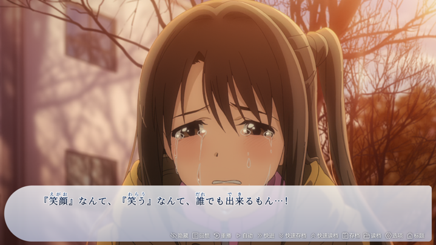

在先前的版本中，我们发布了“在对话中”注音的功能。这一功能将允许你为特定的词语标注注音。如今，我们将拓展这一语法，使其支持文本样式、提示甚至是交互等更多功能。

我们将这一功能称为“文本拓展语法”。文本拓展语法将大大增强游戏运用文本框的方式。

## 文本拓展语法的定义

文本拓展语法是对某段特定文本的增强。被[]包裹的，且后面跟随着()作为文本增强描述的文本是符合文本拓展语法定义的文本。

简单来说，形如以下形式：

```
(文本)[style=font-weight:bold\;color:#005CAF\;font-size:smaller\; ruby=wen ben tips=这是一段增强的文本]
```

这代表这段文本的字体大小是偏小的，并应用了加粗，颜色为 #005CAF，并具有注音和提示。

特别需要注意的是，由于 ; 是 WebGAL 的注释语法，所以在文本拓展语法中应用 ; 需要加 \ 转义，成为 \;

## 文本样式

新的文本拓展语法将支持文本样式的定义。跟在 `style=` 后的语句是标准的 CSS 行内语法。这些样式会被直接加载到文本上。这样，你可以使用标准 CSS 语法来为你的文本添加极为丰富的符合 Web 标准的样式。


## 词语提示

有部分游戏会允许用户在点击或鼠标移动到某个词语上时，在屏幕上出现一小段提示文本。这在介绍游戏所属的世界观中的某些关键概念的定义时非常有用。当然，一部分游戏也可以用这个功能来玩梗。

跟在 `tips=` 后的语句会被作为被标记的词语的提示。

效果可以参见《牵绊闪耀的恋之伊吕波》游戏中常常出现的文本提示


## 注音

注音语法如今被包括在了文本拓展语法中，跟在 `ruby=` 后的文本是注音。



对于这个功能，可能会有很多人有疑惑，这个语法改变是一个破坏性更新吗？

这个语法改变并非破坏性更新。如果你没有使用其他的语法格式，我们会认为这是一个旧版本的语法，并应用注音。也就是说，如果没有出现 `xxx=` 的语法，文本拓展语法仍然按注音来处理。

## 何时发布？

该功能将会在下一次功能更新中实装。我们还计划在文本拓展语法上引入更多的交互功能，以增强视觉小说中“文本框”的玩法。

感谢关注 WebGAL，让我们在下次更新中再见。
